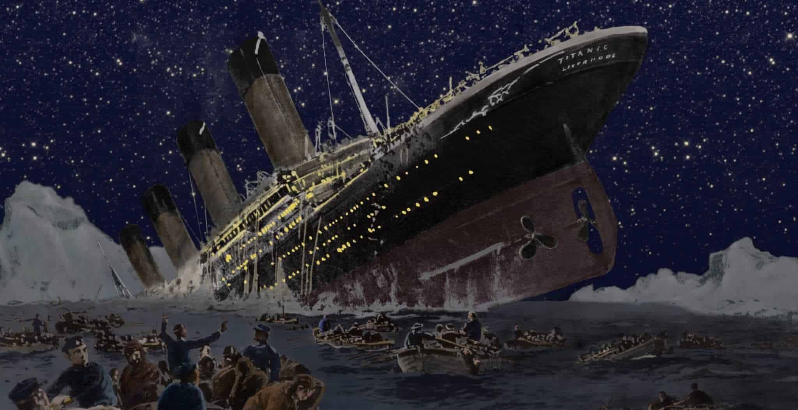

# ML - Titanic Survival Prediction 

The sinking of the Titanic is one of the most infamous shipwrecks in history.

On April 15, 1912, during her maiden voyage, the widely considered “unsinkable” RMS Titanic sank after colliding with an iceberg. Unfortunately, there weren’t enough lifeboats for everyone onboard, resulting in the death of 1502 out of 2224 passengers and crew.

While there was some element of luck involved in surviving, it seems some groups of people were more likely to survive than others.

In this challenge, i build a predictive models that answer the question: “what sorts of people were more likely to survive?” using passenger data (ie name, age, gender, socio-economic class, etc).

# Data Overview
The data has been split into two groups:

training set (train.csv) test set (test.csv)

The training set was used to build the machine learning model. For the training set, the outcome (also known as the “ground truth”) was provided for each passenger. Feature engineering was also used to create new features.

The test set was used to see how well the model performed on unseen data. For the test set, the ground truth for each passenger was not provided. For each passenger in the test set, the trained model was used to predict whether or not they survived the sinking of the Titanic.

The labels of the test set are in (gender_submission.csv) .

The model code in (titanic_comp_ANN_Reg.ipynb) file .

the output of ANN model : (output_ANN.csv) .

the output of Logistic Regression mode : (output_reg.csv).

# Data Dictionary

| Variable  | Definition | Key | 
| ------------- | ------------- |  ------------- |
| Survival  | Survival  |  0 = No, 1 = Yes  |
| pclass  | Ticket Class  |  1 = 1st, 2 = 2nd, 3 = 3rd  |
| sex  | sex of passenger male / female  |    |
| Age  | Age in years  |  Content Cell  |
| sibsp  | number of siblings / spouses aboard the Titanic	  |    |
| Parch  | number of parents / children aboard the Titanic  |     |
| Fare  | Passenger fare  |    |
| Cabin  | Cabin Number  |   |
| Embarked  | Port of Embarkation  |  C=Cherbourg/ Q=Queenstown/ S=Southampton  |
